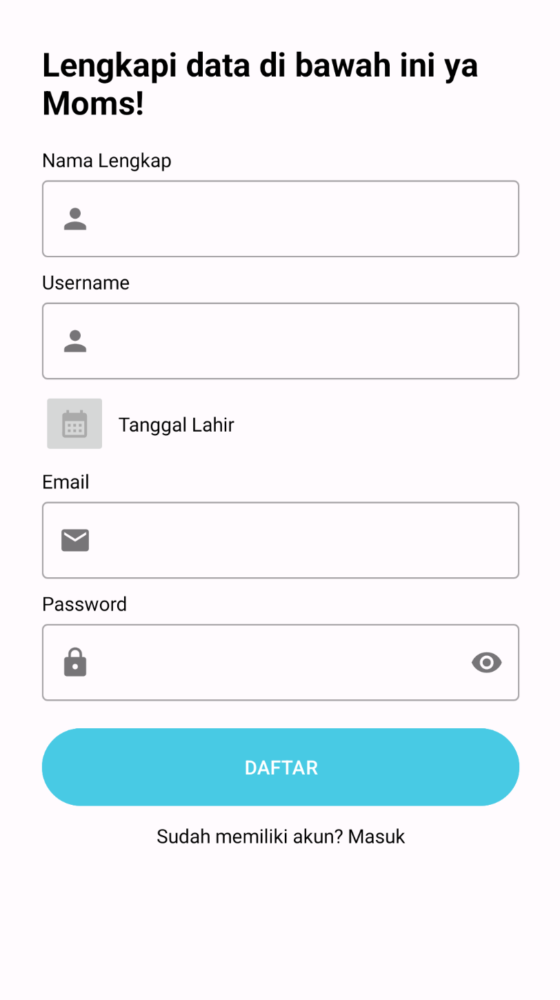
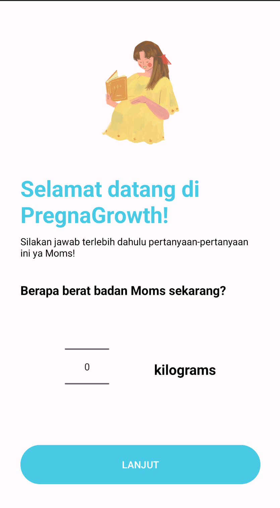
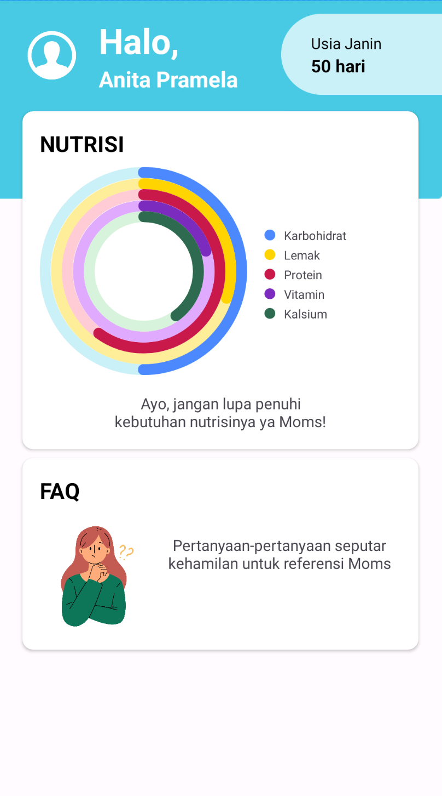
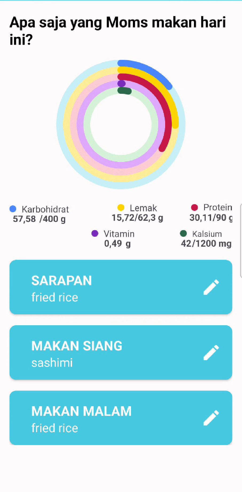
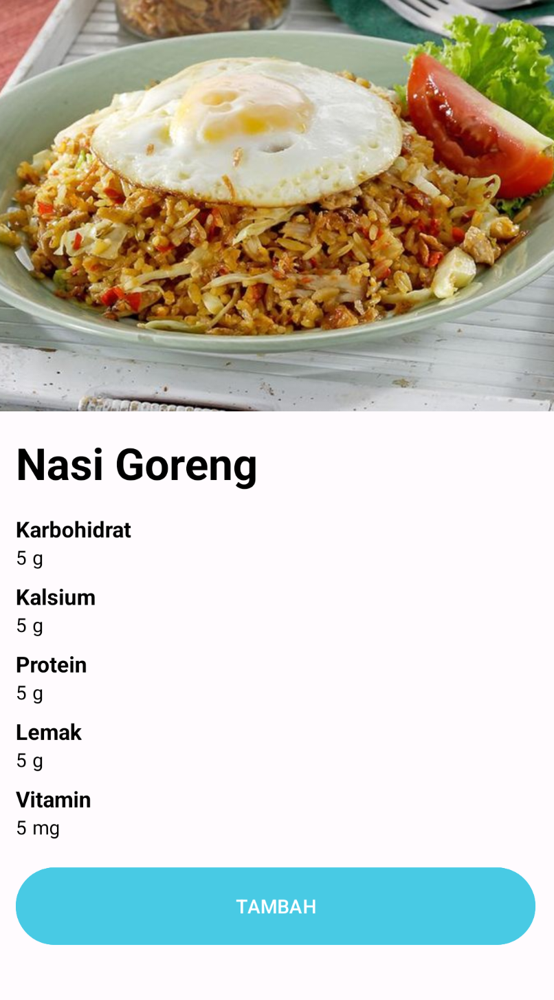
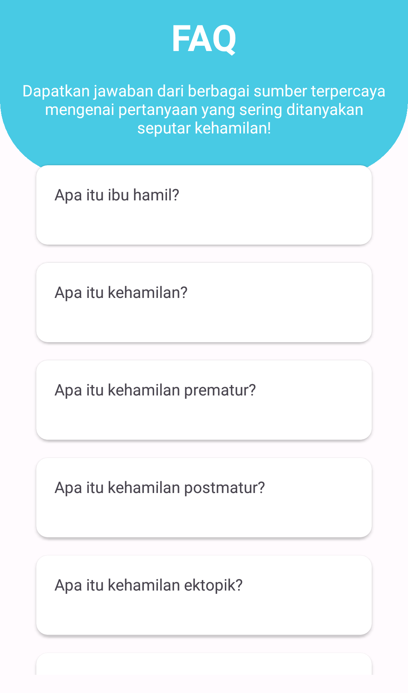
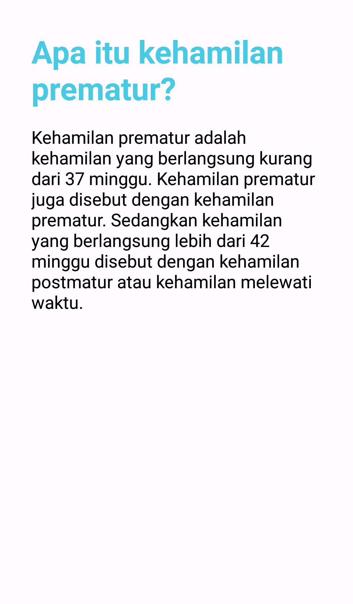

# PregnaGrowth
PregnaGrowth is an Android application specifically made for pregnant mothers to keep track of their daily nutritional intake during pregnancy. This repository contains all the project codes in Android Studio using Kotlin.

# Activities
## Login Activity

This Activity will be displayed when the user opened the application for the first time after it is being installed. This Activity requires users to input their registered email and password.

## Signup Activity

If the user has not yet made an account, then they can register for a new one as shown in the image below. This Activity requires users to input their full name, username, birth date, email and password. The email and username have to be unique.

## Input Weight Activity

After the user successfully registered their new account, the application will ask user to fill their current body weight.

## Input Pregnancy Age Activity

After inputting body weight, the application will ask user to input their current pregnancy age in days.

## Main Activity

This is the home screen of the application after the user successfully logged in. When logged in, the users' session token will be saved in a DataStore to prevent the app to automatically logout. The home screen contains CardView menu for user's daily nutritional intake summary (with Circular Progress Bar) and a menu to go to the FAQ Activity. The Circular Progress Bar shows the users' total carbohydrates, calcium, fats, protein, and vitamin intake for today.

## Detail Intake Activity

This Activity will be opened if the user pressed the daily nutritional summary CardView in the home screen. It shows the same Circular Progress Bar as in the home screen and the total number of user's carbohydrates, calcium, fats, protein, and vitamin intake in grams and/or milligrams. In this Activity, users can add their Breakfast, Lunch, and Dinner by tapping the Camera Button (or Pencil button if it is already been added before) to open camera and capture their food.

## Result Activity

After capturing the food, the application will predict the food name and also the nutritional values of the food that the user ate by using a machine learning model. The result will be shown in the Result Activity. To add the food into the Breakfast, Lunch, or Dinner log, simply click "Tambah".

# FAQ Activity

Lastly, our application also has an FAQ Activity that contains the answers for commonly asked questions regarding pregnancy. Currently, the list has up to 30 questions.

# Dependencies
Below are some external libraries that is being used in the application:
|  Dependencies   |                                Link                                |
| :----------------: | :----------------------------------------------------------------: |
| Retrofit | [Retrofit](https://square.github.io/retrofit/) |
|  Circular Progress Bar  |  [Circular Progress Bar](https://github.com/lopspower/CircularProgressBar)  |
|   Glide  |   [Glide](https://github.com/bumptech/glide)  |

# APK and Notice
You can install the application from the link here: [PregnaGrowth.apk](https://drive.google.com/file/d/1wZg5OXF3PEJdn51DP4Qpg-yRE5QHHCQt/view?usp=sharing)
There are some bugs that needs to be noted and still on fixing process:
1. If the application crashes or returned to the main screen after taking a photo, then you'll need to lower the camera resolution to the lowest setting first.
2. After the first time taking a photo, usually the app will crash or return to main screen due to server problem, but if if you retry it again it will work.
